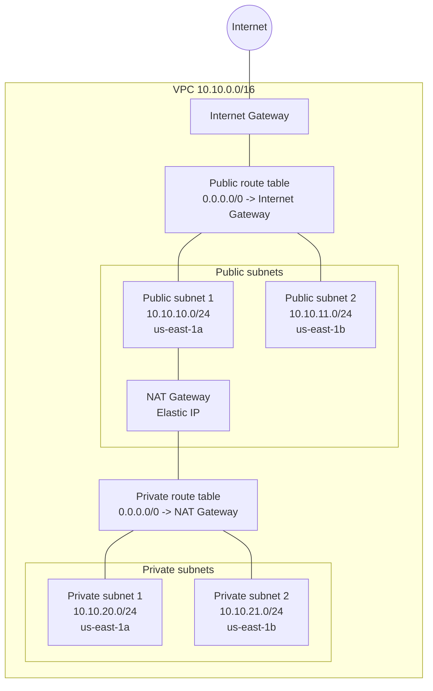
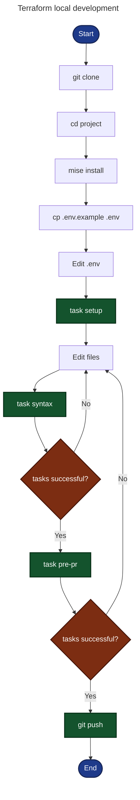

# muyu-infrastructure

This repository contains infrastructure code for the Muyu application.

AWS resources for Muyu are managed with Terraform. This repository is currently
an intentionally small starting point with provider setup and placeholder files.

## Network Architecture

The network layout is:

- Region: `us-east-1`
- VPC: `10.10.0.0/16`
- Public subnet 1: `10.10.10.0/24` in `us-east-1a`
- Public subnet 2: `10.10.11.0/24` in `us-east-1b`
- Private subnet 1: `10.10.20.0/24` in `us-east-1a`
- Private subnet 2: `10.10.21.0/24` in `us-east-1b`
- Internet Gateway for public subnet internet access
- NAT Gateway in public subnet 1 for private subnet outbound internet access
- One route table for public subnets
- One route table for private subnets
- Resources that support tags use a `Name` tag with the `muyu` prefix

> AWS creates a default route table with every VPC. This example does not use it.
> Each subnet is explicitly associated with either the public route table or the
> private route table so the routing decision is visible in Terraform.



## Local Development

This repository uses `mise` to manage development tools and their versions.



### Prerequisites

After cloning the repository, install all required tools defined in `mise.toml`:

```bash
mise install
```

Verify that the required tools are available:

```bash
terraform version
task --version
```

### Environment Setup

Prepare the local development environment:

```bash
task setup
```

This task:

- Initializes Terraform
- Installs Git pre-commit hooks
- Initializes TFLint plugins

### Development Workflow

After making changes, run the fast development checks:

```bash
task syntax
```

This task:

- Formats Terraform files
- Runs TFLint with automatic fixes
- Validates the Terraform configuration

> [!NOTE]
> Repeat this step until all checks complete successfully.

### Before Opening a Pull Request

Run the complete verification suite:

```bash
task pre-pr
```

This task:

- Verifies Terraform formatting
- Validates the Terraform configuration
- Runs TFLint
- Runs Checkov
- Estimates infrastructure cost with Infracost

> [!WARNING]
> Do not commit `tfplan.binary` or `tfplan.json`; plan files can contain sensitive values.

> [!NOTE]
> Only open a pull request after `task pre-pr` completes successfully.

### Available Tasks

#### Development Tasks

| Task          | Description                                                       |
| ------------- | ----------------------------------------------------------------- |
| `task setup`  | Prepare the local development environment                         |
| `task syntax` | Run fast development checks during development                    |
| `task pre-pr` | Run the complete verification suite before opening a pull request |
| `task clean`  | Remove generated Terraform plan artifacts                         |

#### Individual Tasks

| Task             | Description                                 |
| ---------------- | ------------------------------------------- |
| `task init`      | Initialize Terraform                        |
| `task fmt`       | Format Terraform files                      |
| `task fmt-check` | Verify Terraform formatting                 |
| `task validate`  | Validate the Terraform configuration        |
| `task plan`      | Generate Terraform plan artifacts           |
| `task lint`      | Run TFLint                                  |
| `task lint-fix`  | Run TFLint with automatic fixes             |
| `task security`  | Run Checkov against the Terraform plan      |
| `task cost`      | Estimate infrastructure cost with Infracost |


